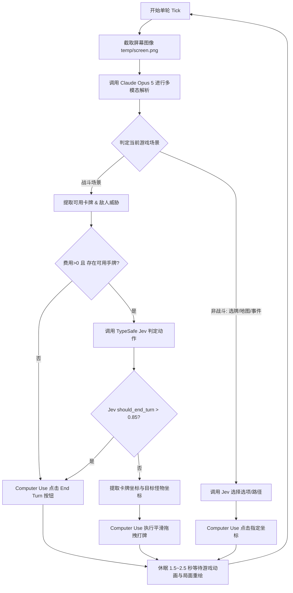

# Slay the Spire 2 自动游玩 Agent Loop 架构与实施计划

## 一、项目目标与设计原则

本项目旨在为《杀戮尖塔 2》（Slay the Spire 2）构建一套从零运行的自动化 Agent 闭环（Agent Loop）。系统结合多模态大模型的视觉感知、TypeSafe Jev 的快速强类型决策，以及原生的 Computer Use 模拟操作能力，让 AI 能够像真实玩家一样在桌面上实时识别局面、决策战术、拖拽出牌，将游戏完整驱动起来。

在架构设计上，本项目严格贯彻**“功能优先、极简闭环、拒绝冗余”**的原则：
- **零过度设计**：不引入繁琐的控制流门禁协议、复杂的版本对齐矩阵或沉重的多层代理协商机制。
- **直击核心闭环**：专注于核心三部曲——“视觉看懂局面（Opus 5）” -> “快速算出动作（Jev）” -> “鼠标真实拖拽（Computer Use）”。
- **先跑通再调优**：初始版本首要目标是搭建稳定、可操作的 Agent Loop，确保手牌能打出、回合能流转、战斗能推进；卡牌高阶策略与协同流派留待闭环确立后再行迭代。

---

## 二、游戏交互现状与方案选型

### 1. 命令行与底层接口现状
- **引擎架构**：《杀戮尖塔 2》由一代的 Java (LibGDX) 迁移至 **Godot 引擎（基于 C# / .NET 9）**。
- **原生终端控制**：原版游戏未开放任何命令行参数、控制台输出或终端交互接口，界面完全通过图形渲染与输入事件驱动。
- **Mod 接口可能性**：社区已有实验性 Mod（如 STS2MCP）通过进程注入暴露 HTTP REST 接口。虽然 Mod 可提供纯数据，但无法提供直观的游玩展示过程。

### 2. 方案确立：纯视觉感知 + 原生 Computer Use 动作驱动
为满足“直观展示打牌效果”的核心要求，系统采用**纯视觉 + 原生桌面输入**作为基准方案：
- **画面感知**：通过桌面/窗口截屏获取实时游戏画面，无需侵入游戏文件或破坏原版游戏完整性。
- **操作展示**：利用原生操作系统输入通道执行平滑鼠标轨迹绘制与拖拽，在屏幕上直观呈现手牌划向敌人的动画轨迹。

---

## 三、模型职责划分：Opus 5 识别 vs Jev 决策

系统的核心是将视觉感知与战术决策解耦，发挥两款模型的最佳特性：

| 职责维度 | Claude Opus 5 (主识别 Loop) | TypeSafe Jev (决策引擎) |
| :--- | :--- | :--- |
| **技术定位** | 多模态大语言模型 (Vision LLM) | 快速强类型 System One 判断模型 |
| **调用配置** | 继承 Claude Code 配置（endpoint: `aster.empeirion.cn:44444`） | TypeSafe 官方 System One 接口（`api.typesafe.ai/v1/systemone`） |
| **响应耗时** | 约 2~4 秒（负责复杂图像特征抽取） | 约 700 毫秒（极速结构化决策） |
| **具体职责** | 1. 识别当前场景（战斗、选卡奖励、地图选路、营地休息、随机事件）<br>2. 提取玩家数值：当前生命值、生命上限、护盾量、可用费用<br>3. 定位手牌：卡牌名称、费用、类型、是否需要指定目标、物理屏幕像素坐标<br>4. 定位敌人：怪物名称、血量、意图类型（攻击/防御/增益）、意图伤害数值、怪物屏幕坐标<br>5. 定位关键 UI：结束回合按钮坐标、确认按钮坐标 | 1. 接收 Opus 5 提取的标准化结构文本<br>2. 提问 `choice`：当前费用下最优打出哪张手牌<br>3. 提问 `choice`：定向攻击牌应当优先攻击哪个敌人<br>4. 提问 `noul`：是否立即结束当前回合<br>5. 提问 `score`：评估敌方下回合造成的生存威胁等级 (1~5) |
| **输出格式** | 纯结构化 `GameState` JSON 对象 | 强类型结构化结果：`{ choice, noul, score, probabilities }` |

### 为什么选择 Jev 承担决策？
1. **零解析风险**：传统 LLM 在决策时往往夹带冗余解释或 Markdown 格式，偶发格式损坏导致打断。Jev 原生输出强类型字段。
2. **延迟极低**：实测单次往返仅 700ms，在回合内连续出牌（如出第一张牌后费用变化，继续决定第二张）时能够快速连续驱动。
3. **内置校准概率**：Jev 输出伴随精准的概率分布（如 `defend: 0.80, strike: 0.03`），代码可直接依据置信度做出防御优先或斩杀优先的分流。

---

## 四、模型输出到 Computer Use 的具象化转化

当 Jev 做出动作选择后，动作执行器将抽象决策转化为可变化的物理输入：

### 1. 坐标体系与高 DPI 适配
Windows 系统在 4K/2K 显示器下通常开启 150%~200% DPI 缩放。执行层通过 `SetProcessDpiAwareness` 确保像素坐标与物理屏幕 1:1 精确映射，避免因缩放导致的点击偏移。

### 2. 模拟操作动作映射表

| Jev 决策指令 | 目标实体类型 | 物理动作行为 (Computer Use) |
| :--- | :--- | :--- |
| `play_card` | 指定目标的攻击牌 | 从手牌坐标 `(startX, startY)` 按余弦缓动曲线平滑拖拽至目标怪物中心 `(endX, endY)`，释放鼠标左键 |
| `play_card` | 非定向牌（技能/群体攻击/能力） | 从手牌坐标按曲线向上拖拽至战场中心空地（`y - 500`）释放，触发全场生效 |
| `end_turn` | 回合结束 | 移动鼠标至右下角 End Turn 按钮坐标，执行短促左键点击 |
| `select_reward` | 战斗后选牌 / 遗物拾取 | 移动鼠标至对应卡牌奖励卡片中心，执行左键点击；随后点击右下方 Proceed 按钮 |
| `choose_path` | 地图节点推进 | 移动鼠标至当前可到达的下一层地图图标（怪物/精英/问号/商店/营火），点击前进 |

### 3. 为什么必须采用“平滑轨迹拖拽”
《杀戮尖塔 2》作为图形化卡牌游戏，如果使用瞬移式的鼠标左键按下和释放，底层的 Godot 引擎输入事件可能无法在单帧内识别出“拖动卡牌进入释放区”的动作判定。通过带有 20~25 步缓动插值的平滑拖拽（耗时约 0.35 秒），不仅能 100% 触发游戏的打牌判定，更能呈现出如同真人游玩的直观视觉效果。

---

## 五、极简 Agent Loop 运行工作流

整个系统的核心调度是一个高度精炼的单线程轮询循环（Tick Cycle）：



---

## 六、本地代码工程结构

项目已在本地独立 Git 仓库完成初始化并经过实调验证，核心代码结构如下：

```text
jevmake/
├── .env.example            # 环境变量配置模板
├── .gitignore              # 忽略环境配置与运行时截图
├── package.json            # Node.js 模块配置与启动脚本
├── README.md               # 项目架构与快速上手指南
├── test_jev.mjs            # TypeSafe Jev 官方接口连通性验证
├── src/
│   ├── computer_use.py     # Windows 原生高 DPI 鼠标拖拽/点击/截屏执行器
│   ├── vision_opus.mjs     # Claude Opus 5 游戏画面多模态结构化提取模块
│   ├── decision_jev.mjs    # TypeSafe Jev System One 战术决策原语封装模块
│   └── agent_loop.mjs      # 核心运行主循环（串联感知、决策与执行）
└── temp/                   # 运行期临时截屏缓存
```

---

## 七、实施计划与阶段路线

### 阶段一：原型连通与执行校验（当前已达成）
- [x] 初始化独立 Git 仓库，完善 ignore 与依赖规范。
- [x] 调通 TypeSafe Jev 官方接口（实测 700ms 强类型决策响应）。
- [x] 调通本地 Claude Code 配置的 Opus 5 接口。
- [x] 编写原生 Windows 鼠标缓动拖拽与截屏工具（支持 4K/2K 高 DPI 自动适配）。
- [x] 完成模拟数据下的 Agent Loop 单步串联测试。

### 阶段二：游戏实景联调与坐标标定（下一步核心）
1. **实机画面感知标定**：启动《杀戮尖塔 2》窗口，使用 Opus 5 截取实战画面，标定手牌栏、敌方站位、能量指示器与回合结束按钮的像素边界。
2. **打牌手感参数微调**：实测拖拽手牌触发打出的最短有效像素距离与松手等待时间，确保 100% 成功率。
3. **战斗内多动连续处理**：在一回合内有 3 点能量时，依次完成 3 次出牌直到 Jev 判定费用耗尽或无牌可打，随后自动点击 End Turn。

### 阶段三：非战斗场景串联（完整通关闭环）
1. **战利品界面自动交互**：识别金币、卡牌奖励、药水，点击选择并点击 Proceed。
2. **地图选路导航**：在地图界面识别可点击的下一层节点，调用 Jev 选择风险平衡路线并点击前进。
3. **营地休息与简单事件**：优先选择休息回复生命值，简单事件默认选择确定推进。

